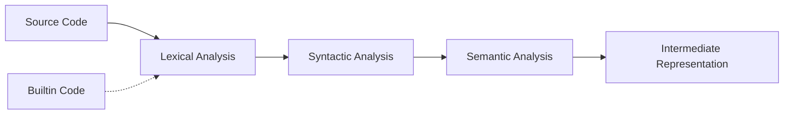
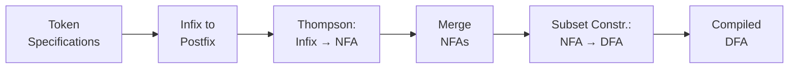
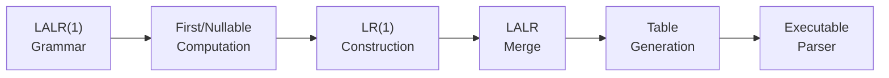

<div align="center">

**University of Havana**

Faculty of Mathematics and Computer Science

# Hulk

## A Modern Compiler

### Final Technical Project Report

John García Muñoz C-312

Cristian Delgado García C-311

June 2026

> “Compilation is the art of translating human intentions  
> into instructions that machines can understand”

</div>

---

## Table of Contents

---

# Introduction

The Hulk compiler is a comprehensive computer science and software engineering project that implements a production-grade compiler for a modern programming language called Hulk (Havana University Language for Kompilers).

## Motivation and Objectives

The purpose of this project is to develop a robust compilation system that demonstrates:

- **Automatic analyzer generation**: Implementation of declarative lexer and parser generators that reduce manual coding effort.
- **Comprehensive semantic analysis**: A sophisticated analysis system capable of detecting type errors, resolving dependencies among functions, and validating program semantics.
- **Efficient cache management**: A frontend caching system that optimizes iterative compilations.
- **Modular infrastructure**: Decoupled components that facilitate future extensions.

## Document Structure

This report presents:

1. The overall compiler architecture
2. The design and automatic generation of the lexical analyzer
3. The design and automatic generation of the LALR(1) parser
4. A conceptual review of the language grammar
5. Semantic analysis and type resolution

# Compiler Architecture

## Overview

The Hulk compiler follows a three-phase pipeline architecture that processes source code sequentially:



The user's input source code is concatenated with a `builtin.hulk` file that defines core protocols and system functions.  
This combined code then flows through the compilation pipeline.

### Main Components

#### Frontend Pipeline

Orchestrates the first three compilation phases.  
Implements caching strategies to avoid recomputing analyses for grammars that have not changed.

#### Analyzer Generators

- **Lexer Generator**: Converts token specifications into an efficient lexical analyzer.
- **Parser Generator**: Implements an LALR(1) generator that builds parsing tables from a BNF grammar.

#### Semantic Analyzer

Performs type checking, name resolution, dependency analysis, and validation of the language's semantic constructs.

## Data Flow

The compiler's data flow is unidirectional:

1. **Input**: Source file + builtin code
2. **Lexer**: Tokenizes the combined text
3. **Parser**: Builds the Abstract Syntax Tree (AST)
4. **Semantic Analysis**: Collects declarations, resolves dependencies, infers types, and validates them

## Error Handling

The compiler implements a hierarchical error system:

- **Lexical Errors**: Invalid characters, malformed strings.
- **Syntactic Errors**: Unexpected symbols, invalid grammatical constructs.
- **Semantic Errors**: Incompatible types, undefined names.

Each error is reported precisely, including line number, column, and contextual information.

# Lexical Analysis and Lexer Generation

## Purpose and Responsibilities

Lexical analysis transforms a sequence of characters into a sequence of tokens.
Tokens represent significant units of the language: keywords, identifiers, operators, and literals.
The Hulk compiler implements an automatic lexer generator that converts regular-expression specifications into highly efficient deterministic finite automata.

## Token Specification

Tokens are defined through declarative specifications that include:

- Reserved keywords (`function`, `type`, `protocol`, etc.)
- Identifiers (patterns: `[a-zA-Z_][a-zA-Z0-9_]*`)
- Numeric literals (integers and decimals: `[0-9]+(\.[0-9]+)?`)
- String literals (between double quotes, with escaping)
- Operators with specific patterns
- Special symbols

Each token specification includes:

- **Type name**: Unique token identifier.
- **Regular expression**: Pattern that the token must match.
- **Priority**: Precedence order when multiple patterns match.

---

## Complete Lexer Generator Pipeline

The lexer generator implements a 5-stage transformation pipeline that converts regular-expression specifications into a compiled DFA:



### Stage 1: Infix-to-Postfix Conversion

#### Problem

Natural regular expressions use infix notation (e.g., `a*|b+`).
Automaton-construction algorithms work more efficiently with postfix notation, where operators appear after their operands (reverse Polish notation).

#### Solution: Modified Shunting Yard Algorithm

For this purpose, the compiler implements a modified version of Dijkstra's Shunting Yard algorithm.

### Stage 2: NFA Construction Using Thompson's Algorithm

#### Theoretical Basis

Thompson's Algorithm is a classic method that builds a Non-deterministic Finite Automaton (NFA) from a regular expression.
The idea behind the algorithm is:

- Each regular expression $e$ corresponds to an NFA with exactly one start state and one accepting state.
- NFAs are built compositionally: operators create new NFAs by combining smaller NFAs.

### Stage 3: Merging Multiple NFAs

Since the lexer specifies multiple token patterns (one per token type), all individual NFAs must be combined into a single NFA that recognizes the union of all patterns.

#### Algorithm

1. Create a new start state $s_0$.
2. For each individual NFA with start state $s_i$:
   - Copy the NFA, increasing all state identifiers (offset) to avoid collisions.
   - Add an $\epsilon$ transition from $s_0$ to the start state of the copy.
3. Group all accepting states of the individual NFAs into the accepting-state set of the unified NFA.
4. Preserve the information indicating which token type corresponds to each accepting state.

#### Result

The unified NFA recognizes any pattern defined by any of the tokens and propagates token-type information through accepting states.

### Stage 4: NFA to DFA Conversion (Subset Construction)

#### Problem

The NFA has non-deterministic transitions (including $\epsilon$ transitions).
During NFA simulation, after reading a symbol, the automaton may be in multiple states simultaneously.
This requires depth-first search or parallel simulation, which is inefficient for high-performance lexing.
The solution is to convert the NFA into a DFA (Deterministic Finite Automaton), where each state represents a set of NFA states and transitions are deterministic.

#### Algorithm: Subset Construction

The subset construction algorithm transforms an NFA into an equivalent DFA by simulating all possible sets of NFA states as DFA states.

It begins by computing the $\epsilon$-closure of the NFA's initial state, which includes all states reachable through $\epsilon$ transitions, and turns it into the initial DFA state.

Then, for each unprocessed DFA state (a set of NFA states), the move function is computed for each symbol in the alphabet, obtaining the NFA states reachable by consuming that symbol, and the $\epsilon$-closure is applied again to close over $\epsilon$ transitions.

The result of this process is another set of NFA states that, if it has not been seen before, becomes a new DFA state and is added to a processing queue.

In addition, transitions are recorded from the current DFA state to the new state for each symbol.

If any of the sets contains an NFA accepting state, the corresponding DFA state is marked as accepting, assigning it the appropriate token type (normally the one with the lowest priority).

The algorithm repeats this process until all generated DFA states have been explored, producing a complete DFA with deterministic transitions.

#### Optimization: State Canonicalization

To avoid creating duplicate states, a hash map is used to map sets of NFA states to DFA states.
The hash key is a consistent hash of the state set.

#### Advantages of the DFA

- Determinism: From any state and symbol, there is exactly one transition.
- Runtime efficiency: Simulation in $O(|\text{text}|)$, one character → one transition.
- Compilability: The transition table can be compiled into two-dimensional arrays.

---

## Runtime Tokenization Algorithm

With the compiled DFA, tokenization is highly efficient:

1. **Current state**: Initialize to the DFA start state.
2. **Lexeme buffer**: Initialize empty.
3. **Position tracking**: Maintain line and column.
4. **For each character in the input**:
   - Query transition: $\text{next} = \text{transitions}[\text{state}][c]$.
   - If a transition exists: advance to the next state, append the character to the lexeme.
   - If no transition exists:
     - If the current state is accepting: emit the token of the type registered in that state, reset.
     - If it is not accepting: lexical error at the current position.
5. **At end of input**: Emit the last token if the current state is accepting.

#### Priority Handling

When multiple patterns match the same text, the compiler selects the first registered one (token-type ordering).
This allows keywords to be defined as special tokens that take precedence over generic identifiers.

---

## Resolved Challenges

### Problem: Keywords vs. Identifiers

**Solution**: Register keywords with higher priority than the generic identifier pattern.

When the DFA reaches an accepting state, the lexer uses the token type with the lowest ID.
Thus, the keyword `function`, registered first, has priority over the pattern `[a-zA-Z]+`.

### Problem: Ambiguous Numbers (Integers vs. Decimals)

**Solution**: Specify two patterns:

- Decimal: `[0-9]+\.[0-9]+`
- Integer: `[0-9]+`

Register decimal with higher priority.

The DFA will prefer the longest match thanks to continuing as long as valid transitions exist.

### Problem: Strings with Special Characters

**Solution**: Define a string pattern that includes escaping:

- Pattern: `"([^"\\]|\\.)*"`
- It interprets any character between quotes except an unescaped quote, or an escape followed by any character.

### Problem: DFA Spatial Efficiency

**Solution**: In some cases the DFA may be large. The compiler implements:

- **Sparse representation**: Store only existing transitions (maps/dicts).
- **Compaction**: Detect and merge equivalent states (DFA minimization).

# Syntactic Analysis and Parser Generation

## Purpose and Responsibilities

Syntactic analysis is the compiler phase that verifies that the sequence of tokens provided by the lexical analyzer conforms to the language grammar and, from it, constructs an Abstract Syntax Tree (AST) that serves as input for the subsequent phases (semantic analysis and code generation).  
The Hulk compiler implements an LALR(1) parser generator that, starting from a declarative grammar specification (similar to Yacc/Bison), automatically builds the parsing tables and execution code.  
The main responsibilities of this module are:

- Build the LALR(1) automaton from the grammar, including the computation of **First** and **Nullable** sets.
- Generate the \textsc{Action} tables (for terminals) and \textsc{Goto} tables (for non-terminals) that guide the parser at runtime.
- Detect and report conflicts (shift/reduce and reduce/reduce) so that the developer can resolve them.
- Execute syntactic analysis over a sequence of tokens, applying reductions and building the AST through an associated \textit{builder}.

---

## Complete Parser Generator Pipeline

The parser generator follows a 5-stage pipeline, which transforms the grammar into an executable parser:



Each of these stages is detailed below.

### Stage 1: Computation of **First** and \textsc{Nullable} Sets

#### Problem

The construction of LR(1) states and the computation of lookahead sets require knowing, for each symbol sequence, the set of terminals that may appear in first position (**First**) and whether the sequence can derive the empty string (\textsc{Nullable}).  
These sets are the basis for the closure function and item generation.

#### Solution: Fixed-Point Iterative Algorithm

The compiler implements the standard algorithm for computing **First** and \textsc{Nullable}:

1. Initialize \textsc{Nullable} to `false` for all non-terminal symbols.
2. Initialize **First** of each terminal with the terminal itself.
3. For each production $A \to X_1 X_2 \dots X_k$:
   - If all the $X_i$ are \textsc{Nullable}, then $A$ is \textsc{Nullable}.
   - **First**($A$) includes **First**($X_1$); if $X_1$ is \textsc{Nullable}, it also includes **First**($X_2$), and so on.
4. Repeat the process until no changes occur.

These sets are stored in a `FirstResult` structure that is passed to the following stages.

### Stage 2: Construction of the LR(1) Automaton

#### Problem

The LALR(1) parser is based on a state automaton whose states represent sets of \textit{items} LR(1).  
An item is a production with a dot indicating the current parsing position, together with a set of lookahead terminals.  
The construction must generate all states reachable from the initial state through the closure function and the transition (\textit{goto}) operation.

#### Solution: Canonical LR(1) Construction Algorithm

The compiler implements the canonical construction of LR(1) item sets (Knuth's algorithm), which is carried out as follows:

1. **Initial item**: Starting from the augmented production $S' \to S$ (added internally), the item $[S' \to \cdot S, \$]$ is created.
2. **Closure**: Given a set of items, all items reachable through $\epsilon$ transitions are added (that is, when the dot is before a non-terminal, the productions of that non-terminal are added with lookaheads computed from **First** of the remaining sequence).
3. **Transition (\textit{goto})**: For a state and a symbol $X$, all items whose dot is before $X$ are obtained, the dot is advanced, and the closure of the result is computed.
4. **Canonicalization**: The process is repeated starting from the initial state, adding new states until no new item sets appear. Each state is identified by its set of items (ignoring lookaheads) and assigned a unique identifier.

The implementation in `lalr_algorithms.cpp` uses a work queue and a fingerprint map to avoid duplicates.  
The fingerprint is computed by ordering items by (production, dot position, lookahead), which guarantees efficient identification.

### Stage 3: LALR Merging

#### Problem

The canonical LR(1) automaton can have a very large number of states, which makes the parsing tables large.  
The LALR(1) method reduces the size of the automaton by merging states that have the same \textit{core} (that is, the same items ignoring lookaheads), combining their lookahead sets.  
This merge is safe because any conflicts that might arise are already present in the original LR(1) automaton.

#### Solution: Grouping by Core

The `merge_to_lalr_impl` function traverses all canonical LR(1) states and groups them according to their core (represented by a string encoding the pairs (production, dot position)).  
For each group, a new LALR state is created containing the union of all lookaheads of the corresponding items.  
Then, transitions are reassigned using the mapping from old states to new states.  
The result is a much more compact LALR(1) automaton that preserves the parsing power of the original LR(1).

### Stage 4: Parsing Table Generation

#### Problem

The LALR(1) automaton must be translated into two tables that guide the parser at runtime:

- \textsc{Action}[state, terminal] $\to$ \{shift, reduce, accept, error\}
- \textsc{Goto}[state, non-terminal] $\to$ next state

These tables are built from the automaton transitions and reduction items.

#### Solution: Table-Filling Algorithm

The `build_tables` function performs the following steps:

1. For each automaton transition whose destination is a terminal, a \textsc{Shift} action is added to the \textsc{Action} table.
2. For each transition whose destination is a non-terminal, an entry is added to the \textsc{Goto} table.
3. For each state, all its items are traversed. If an item has the dot at the end of the production (reduction item), a \textsc{Reduce} action is added for each lookahead of the item. If the production is the augmented one and the lookahead is \$, \textsc{Accept} is added.
4. When an attempt is made to add an action to an already occupied cell, a conflict (shift/reduce or reduce/reduce) is recorded and stored in the conflict list.

The result is the \textsc{Action} and \textsc{Goto} tables that will be used by the runtime parser.

### Stage 5: Parser Execution and AST Construction

#### Problem

At runtime, the parser must traverse the token sequence, consult the tables, and apply the corresponding actions (shift, reduce, accept) while maintaining a stack of states and a stack of semantic values.  
In addition, it must invoke the \textit{ast builder} to construct the AST as reductions are performed.

#### Solution: LR Parsing Algorithm

The executable parser implements the classic LR parsing algorithm:

1. Initialize the state stack with state 0 and the value stack empty.
2. At each iteration:
   - Obtain the current state (top of the state stack) and the current symbol (next token or \$ if there are no more tokens).
   - Consult the \textsc{Action} table to obtain the action associated with the pair (state, symbol).
   - If the action is \textsc{Shift}: consume the token, push the new state and the semantic value of the token (if provided).
   - If the action is \textsc{Reduce}: pop as many states as symbols are in the right-hand side of the production, obtain the resulting state, consult the \textsc{Goto} table for the non-terminal of the production, and push the new state. In addition, the \textit{ast builder} is invoked with the production identifier and the list of semantic values from the right-hand side, and the result is pushed as the semantic value.
   - If the action is \textsc{Accept}: finish successfully, and the semantic value at the top of the stack is the root node of the AST.
   - If there is no action or it is \textsc{Error}: report a syntactic error with the token location.

### AST Builder Integration

AST construction is delegated to an external \textit{builder} that the parser invokes during each reduction.  
This mechanism separates syntactic analysis logic from AST generation, making maintenance and evolution easier.

#### Builder Interface

The \textit{ast builder} (implemented in `ast_builder.cpp`) exposes a single public method:

```verbatim
ASTNode* build(size_t prod_id, const std::vector<Value>& rhs);
```

This method receives:

- `prod_id`: the identifier of the production being reduced.
- `rhs`: the semantic values of the symbols on the right-hand side of the production (which may be AST nodes or tokens).

#### Construction Process

The \textit{builder} uses the grammar and the production identifier to determine what kind of AST node should be created:

1. For each production, a matching pattern (`match`) is defined that checks the name of the left-hand side and the names of the symbols on the right-hand side.
2. If the pattern matches, the corresponding construction code is executed:
   - The semantic values of the right-hand-side symbols are accessed through macros such as `RHS(i)` or `TOKEN(i)`.
   - The appropriate AST nodes are created (for example, `NumberNode`, `BinaryOpNode`, `FunctionDeclNode`, etc.).
   - Spans (location in the source code) are assigned to the nodes using `attach_span`.
   - The root node of the reduction is returned.
3. If no rule matches, a debugging message is emitted and `nullptr` is returned.

#### Construction Example

For `additive : additive PLUS multiplicative`, it executes the macro `BIN_OP("+")` abstracting positions 0 and 2. For complex function declarations, it delegates to `build_function_like`, abstracting the identifier, parameters, and internal blocks.  
This macro extracts the nodes from the left and right sides of the RHS (at positions 0 and 2), and creates a `BinaryOpNode` with operator `"+"` and those children.  
For the production `function_decl : FUNCTION IDENTIFIER L_PAREN param_list_opt R_PAREN block`, the \textit{builder} calls `build_function_like`, which extracts the name (position 1), the parameter list (position 3), and the body (position 5), and creates a `FunctionDeclNode`.

#### Advantages of This Approach

- **Separation of responsibilities**: The parser only handles the sequence of actions; the \textit{builder} handles the semantics of AST construction.
- **Extensibility**: Adding new productions only requires adding new patterns in the \textit{builder}, without modifying the parsing algorithm.
- **Debugging**: Uncovered rules emit messages that help identify unimplemented productions.

---

## Key Algorithms

### LR(1) Closure

The closure of a set of items is computed iteratively.  
For each item $[A \to \alpha \cdot B \beta, a]$ where $B$ is a non-terminal, the items $[B \to \cdot \gamma, b]$ are added for each production $B \to \gamma$ and each $b \in **First**(\beta a)$.  
The algorithm is implemented in the `closure_lr1` function, which uses a work queue to propagate new items and lookaheads.

### Goto

Given a state and a symbol $X$, the \textit{goto} operation produces a new state containing all the items from the original state whose dot is before $X$, advancing the dot one position, and then computing the closure.  
This operation is used to build the automaton transitions.

### State Fingerprinting

To uniquely identify each LR(1) state and avoid duplicates, a \textit{fingerprint} is generated from the items and their lookaheads, sorted canonically.  
This fingerprint is used as the key in a map that assigns fingerprints to state identifiers.

### Conflict Resolution

When a conflict is found during table generation (two different actions for the same cell), the compiler records it and reports it to the developer.  
The system does not attempt to resolve them automatically (except in very simple cases such as preference for shift in shift/reduce conflicts, which is the usual convention).  
Instead, detailed information is provided (state, symbol, conflicting actions) so that the developer can modify the grammar.

---

## Resolved Challenges

### Integration with the Lexical Analyzer

The parser receives a sequence of tokens already classified by the lexer.  
For this purpose, each token includes its symbol identifier (which matches the grammar terminals), its textual value, and location information.  
During analysis, the parser consumes tokens sequentially and, if it encounters an error, can report the exact line and column.

### Handling the \$ Symbol

The \$ symbol (end of input) is treated as a special terminal.  
An augmented production $S' \to S$ is added and \$ is used as the lookahead for acceptance.  
The handling of \$ is integrated into table construction (Accept action) and into the runtime parser (when no more tokens remain).

### Table Efficiency

The \textsc{Action} and \textsc{Goto} tables are represented as vectors of maps (associative containers) to save space, since most cells are empty.  
At runtime, map lookup is efficient and allows grammars of moderate size to be handled without performance issues.

# Semantic Analysis and Inference Pipeline

## Purpose and Responsibilities

Semantic analysis is the phase responsible for validating program correctness, resolving names and overloads, inferring types, and annotating the Abstract Syntax Tree (AST) with all the type information needed for code generation.
This phase transforms a syntactically correct AST into a semantically validated AST, detecting errors such as undeclared variables, incompatible types, ambiguous overloads, or protocol contract violations.
The semantic pipeline is orchestrated by the `SemanticAnalyzer` module and executed by the `TypeInferenceVisitor`, relying on three fundamental data structures:

- **Symbol table (`SemanticSymbolTable`)**: Stores nested scopes with variables, parameters, functions (with overloads), and the `self` symbol.
- **Nominal type and protocol registry (`NominalTypeRegistry`)**: Manages inheritance, attributes, methods, and constructors.
- **Dependency graph (`DependencyGraph`)**: Models calls between functions in order to analyze them topologically.

---

## Complete Semantic Analysis Pipeline

Semantic analysis is executed in a 5‑stage pipeline that traverses the AST in two modes: collection (symbol and dependency registration) and analysis (inference and validation).
A crucial design choice is the separation of collection and analysis. This two‑pass approach allows functions and types to reference each other freely without requiring a strict declaration order.
The first pass registers all symbols and builds the dependency graph;
the second pass performs the actual type inference using the gathered information.

| Stage                        | Main Action                                              |
| ---------------------------- | -------------------------------------------------------- |
| 1. Declaration collection    | Register types, protocols, functions, and dependencies   |
| 2. Topological ordering      | Order functions according to the dependency graph        |
| 3. Function analysis         | Infer the parameter and return types of each function    |
| 4. Type analysis             | Validate attributes, methods, and type constructors      |
| 5. Global statement analysis | Infer the program type and verify standalone expressions |

### Stage 1: Declaration and Dependency Collection

#### Problem

Type analysis requires all declarations (types, protocols, functions) to be registered before their bodies are analyzed.
In addition, functions must be analyzed in an order that respects dependencies (a function that calls another must be analyzed after the callee).
The dependency graph addresses a fundamental challenge in type inference: a function's body cannot be accurately typed until the callees it invokes have been fully analyzed.

#### Solution: Collection‑Mode Traversal

The visitor traverses the AST with the flags `collecting = true` and `collectingDependencies = true`.
During this traversal:

1. All types and protocols are registered in `NominalTypeRegistry` through `registerType()` and `registerProtocol()`.
   Each type stores its name, inheritance, constructor parameters, and an initial list of attributes and methods (not yet analyzed).
2. Each function declaration (`FunctionDeclNode`) creates a `FunctionType` (with parameters and return type possibly `Unknown`) and registers it in the symbol table (with overloads).
   The node is added to the `pendingFunctions` list.
3. A node is added to the dependency graph with the function's AST, and the function body is traversed (if `collectingDependencies` is active) to detect calls to other functions.
   Each call adds an edge to the graph.
4. Finally, `resolveParentsAndConstructors()` is invoked to resolve the parent type of each type, copy inherited attributes and methods, and validate constructor consistency (arity and types).

#### Result

At the end of this stage, the type registry contains all types and protocols with their hierarchy resolved, the symbol table contains all functions with their signatures (even if some types may still be `Unknown`), and the dependency graph models all calls between functions.

### Stage 2: Topological Ordering of Functions

#### Problem

For type inference to work correctly, functions must be analyzed in an order that guarantees that when one function calls another, the callee already has its types inferred.
If a function is analyzed before its dependencies are ready, argument types may remain `Unknown`.

#### Solution: DFS Algorithm on the Dependency Graph

The dependency graph is topologically sorted by means of a depth‑first search (DFS) that detects cycles.
The algorithm is:

1. Mark all nodes as unvisited.
2. For each unvisited node, perform DFS:
   - Mark the node as visited and on the recursion stack.
   - For each neighbor (dependency), if it is not visited, call DFS recursively.
   - If the neighbor is already on the recursion stack, a cycle has been detected.
   - When finished, add the node to the topological order list (post‑order).
3. Reverse the list to obtain the natural order (dependencies before dependents).

If a cycle is detected, a warning is emitted and declaration order (the order in which nodes appear in the AST) is used as a fallback.

#### Result

An ordered list of functions is obtained that respects all direct dependencies,
allowing sequential analysis without type conflicts.

### Stage 3: Function Analysis

#### Problem

Each function must be analyzed to infer the types of its parameters (if they are not annotated),
the return type (if it is not declared), and to verify that internal expressions are consistent with those types.

#### Solution: Analysis‑Mode Visitor

For each function, the visitor performs the following steps:

1. Retrieves the `FunctionType` registered during collection.
2. Creates a scope for the function and, if it is a method, inserts `self` with the owner's type.
3. Creates a child scope for the parameters, inserting each parameter with the type it has in the signature (possibly `Unknown`).
4. Analyzes the function body (block or expression), which propagates constraints and refines (more on this below) the types of symbols.
5. After analysis, captures the final parameter types from the symbol table through `captureFunctionParameterTypes()`.
   If any unannotated parameter remains `Unknown`, an error is emitted.
6. Updates the return type: if it was not declared, the actual type of the body is used;
   if it was declared, conformity is checked.

Refinement is the mechanism by which the semantic analyzer dynamically adjusts
the types of variables and parameters as it discovers more information
about their use in the program.
When a variable is declared without an explicit annotation, its type is initially set
to `Unknown`;
later, as it participates in operations (such as additions, comparisons, or function calls),
the system imposes constraints that progressively narrow that type: for example, if it appears in an addition, it is refined to `Number`;
if it is used as an argument to a function that expects a `String`, it is refined to `String`.
Refinement also acts on function parameters that do not have annotations: by analyzing the calls
that they receive, the type of the actual arguments is propagated backward to fix the parameter type.

This refinement process is incremental. When a variable is first encountered, its type is Unknown. As the visitor traverses the body, each operation imposes a constraint—for example, an addition suggests Number, a comparison suggests Bool.
The symbol table is updated immediately, and subsequent uses of the variable benefit from the newly inferred type.
If contradictory constraints arise (e.g., a variable is used both as a Number and as a String), the system reports a type error with a clear explanation of the conflict.

#### Result

Each function is annotated with the concrete types of its parameters and its return type.
The `FunctionType` is updated in the symbol table and in the AST node.

### Stage 4: Type Analysis

#### Problem

The user‑declared types (`type`) must be validated: attributes must have types compatible with their initializers,
methods must be correct, and the parent's constructor must be invoked properly.

#### Solution: Sequential Attribute and Method Analysis

The visitor traverses each registered type and:

1. Resolves the nominal type of the type if it is not already resolved.
2. If the type has explicit arguments for the parent constructor, validates arity and argument conformity in the context of the constructor parameters.
3. Analyzes each attribute: resolves the declared type (if any), infers the type of its initializer,
   and checks conformity.
   The type registry is updated with the final attribute type.
4. Analyzes each method by running the same function‑analysis process (with `isMethod = true`),
   which includes the insertion of `self`.

#### Result

All attributes and methods are annotated with their final types,
and errors such as incompatible initializers or methods that do not respect the inherited signature are detected.

### Stage 5: Global Statement Analysis

#### Problem

The program may contain standalone expressions at the top level (e.g., blocks, `let` without a semicolon, function calls).
These must also be typed and checked.

#### Solution

The visitor analyzes the program statements (`root->stmts`) in analysis mode, computing the type of each one and propagating constraints.
The program type is the type of the last statement, or `Void` if there is none.

---

## Key Algorithms

### Constraint‑Based Type Inference

The type inference system collects implicit constraints as expressions are visited.
Each constraint relates a node (variable, parameter, lambda) with an expected type.
When a constraint is encountered, `refineUnknownExpression()` is invoked,
which updates the corresponding symbol if its current type is `Unknown`.
If the symbol already has a concrete type and the new constraint is incompatible,
an error is emitted.
Constraints are generated from:

- Arithmetic operators ($+$, $-$, $*$, $/$, $\%$, $\wedge$): refine operands to `Number`.
- Comparisons ($<$, $>$, $\le$, $\ge$): refine operands to `Number`.
- Concatenation ($@$, $@@$): refine operands to `String` or `Number`.
- Logical operators ($\&$, $|$, $!$): refine operands to `Bool`.
- Function calls: each argument is refined to the type of the corresponding parameter of the selected overload.
- Assignments: the right‑hand side refines the type of the left‑hand‑side variable.

#### Handling Generic vs. Specific Numbers

The language distinguishes between `Number` (generic) and `Number<kind>` (specific).
When they are mixed, they are promoted to the widest common type through `commonNumberType`. For example, `Number<int>` $+$ `Number<double>` $\to$ `Number<double>`;

Furthermore, assignments can cause a variable's type to be generalised, not just refined. If a variable initially has a specific numeric type (e.g., `Number<int>`) and is later assigned a value of a wider type (e.g., `Number`), the variable's type is promoted to the common supertype (`Number` in this case). This prevents spurious errors in patterns like `sum := sum + f(i)`, where `sum` started as `Number<int>` but `f(i)` returns generic `Number`.
The assignment rule is applied before the standard conformance check, making numeric types flexible while preserving safety.
`Number<int>` $+$ `Number` $\to$ `Number`.

In assignments, if a variable of a specific numeric type receives a value of a generic type, the variable's type is automatically generalized (e.g., `sum := sum + f(i)` converts `sum` from `Number<int>` to `Number`).

### Overload Resolution

The overload resolution algorithm is implemented according to the following idea:

1. Search the symbol by name.
   If it does not exist, return `SymbolNotFound`. If it exists but is not a function, return `NotAFunction`.
2. For each overload (`FunctionType`):
   - Compare arity.
     If it differs, record the reason and continue.
   - If arity matches, check each argument against the corresponding parameter using the conformity function (`conforms`).
   - Compute a compatibility cost: 0 for exact match, 1 for inheritance‑based conformity, 3 for `Any`, 4 for `Unknown`, 1000 for incompatibility.
   - If all arguments conform, the candidate is viable and its cost is stored.
3. Selection:
   - If exactly one candidate has the lowest cost $\to$ it is selected and the status is `Resolved`.
   - If several candidates share the same minimum cost $\to$ status is `Ambiguous`.
   - If no candidate is viable but at least one had the correct arity $\to$ status is `TypeMismatch`.
   - If no candidate had the correct arity $\to$ status is `ArityMismatch`.
4. The result includes the list of candidates with failure reasons, which makes it possible to generate detailed diagnostics.

### Type and Protocol Conformity

Conformity (subtyping) is defined through `typeConforms` and `NominalTypeRegistry::conforms`.
The main rules are:

- Exact equality.
- `Unknown` and `Any` conform to any type (and vice versa).
- `Object` conforms to any type other than `Void` (all are objects).
- Numbers: generic `Number` conforms to any specific number; a specific number conforms only to the same specific type or to generic `Number`.
- Iterables and vectors: `Iterable<T>` conforms to `Iterable<U>` if $T$ conforms to $U$;
  `Vector<T>` conforms to `Iterable<U>` if $T$ conforms to $U$; `Vector<T>` conforms to `Vector<U>` if $T$ conforms to $U$.
- Functions: one function conforms to another if the parameters conform in reverse order (contravariance) and the return type conforms (covariance).
- Nominal inheritance: a nominal type conforms to its parent and all its ancestors.
- Protocols: a type conforms to a protocol if it implements all protocol methods with compatible signatures (allowing covariance in the return type).
  Verification is structural.
